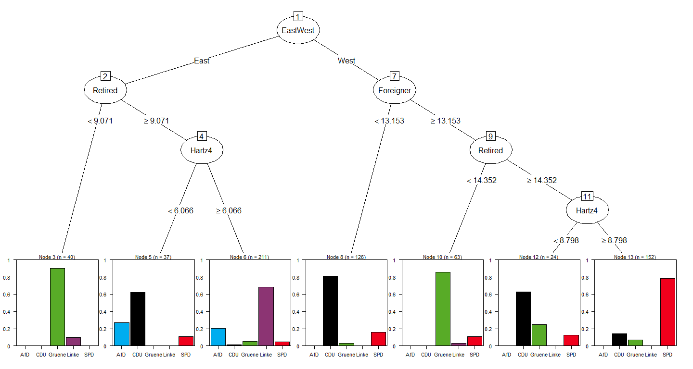

Berlin Election 2016
================

### How did Berlin vote?

On 18th September 2016, Berlin voted for the state elections. The analysis applies classification tree methods to understand how did Berlin vote. Data from the characteristics and demographics of voters are used to describe the likelihood of voters' decisions.

<!-- -->

This shows that if a voting area is in East Berlin, and has less than 9.071% of Retiree, the Winner of that area is Gruene, with a likelihood is more than 80%. On the other hand, if a voting area is in West Berlin, and has less than 13% Foreigners, there is a 80% likelihood that the winning party is CDU.

Credit: The <a href="http://interaktiv.morgenpost.de/wahlsieg-formel-berlin/" target="_blank">voting classification tree</a> and the <a href="http://berlinwahlkarte2016.morgenpost.de/" target="_blank">voting map</a> were inspired by the <a href="http://www.morgenpost.de/" target="_blank">Berliner Morgenpost</a>, along with the <a href="https://gist.github.com/berlinermorgenpost/f7c59ef94d21c7c942150b64d5e3ba4d" target="_blank">voting tree data</a> as well as the <a href="https://gist.github.com/berlinermorgenpost/f7b98db3f8a215f34e1e4bc1b4f5a363" target="_blank">sociodemographic data</a>.

Data source of Berlin vote results are found <a href="https://www.wahlen-berlin.de/home.asp" target="_blank">here</a>.

<a href="/berlin_map_tree_final_code.html">Click here for this page with the respective R code</a>.
